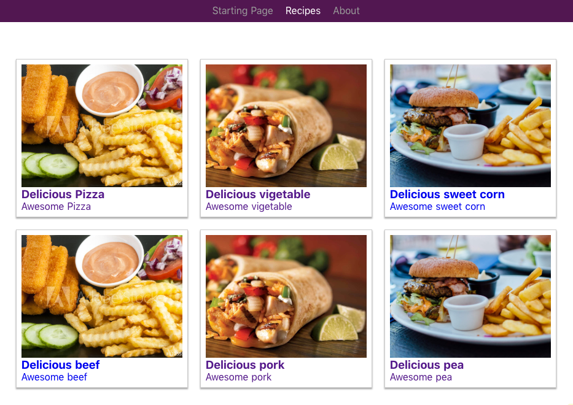

# recipes

> My outstanding Nuxt.js project

## demo 图例
* 启动页


* recipes 列表页



* 详情页


## 常见启动错误
  - Error: getaddrinfo ENOTFOUND localhost

      add 127.0.0.1 localhost to /etc/hosts

## Build Setup

``` bash
# install dependencies
$ npm install

# serve with hot reload at localhost:3000
$ npm run dev

# build for production and launch server
$ npm run build
$ npm start

# generate static project
$ npm run generate
```

For detailed explanation on how things work, checkout [Nuxt.js docs](https://nuxtjs.org).
